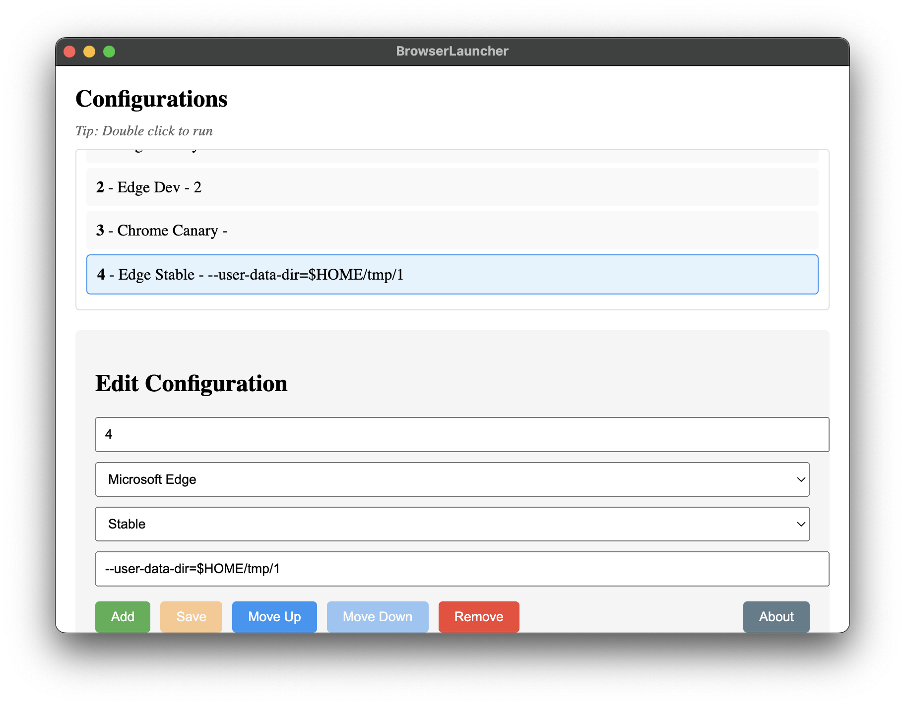

# BrowserLauncher

A cross-platform browser configuration manager and launcher for Microsoft Edge and Google Chrome.



## Features

- Support for multiple browsers (Edge and Chrome)
- Multiple channel support (Stable/Beta/Dev/Canary)
- Custom launch arguments
- Configuration management
- Cross-platform support (Windows, macOS, Linux)

## Development

Clone the repository

```bash
git clone https://github.com/halton/BrowserLauncher.git
```

Go into the repository

```bash
cd BrowserLauncher
```

Install dependencies

```bash
npm install
```

## Run build

```bash
npm start
```

## Build packages

Build for your platform:

```bash
npm run build
```

Build packages for specific platform

```bash
npm run build:win # Windows
npm run build:mac # macOS
npm run build:linux # Linux
```

## License

[MIT](LICENSE)

